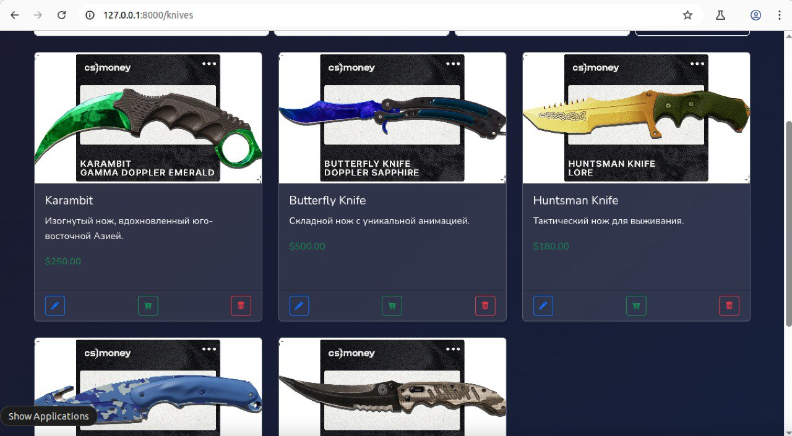
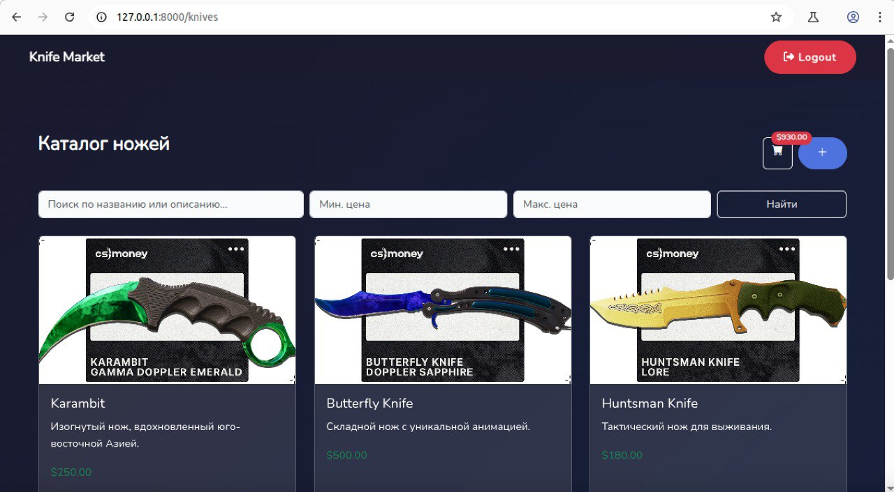
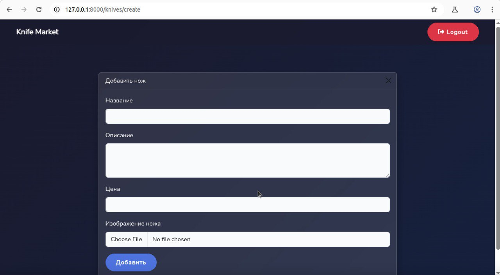
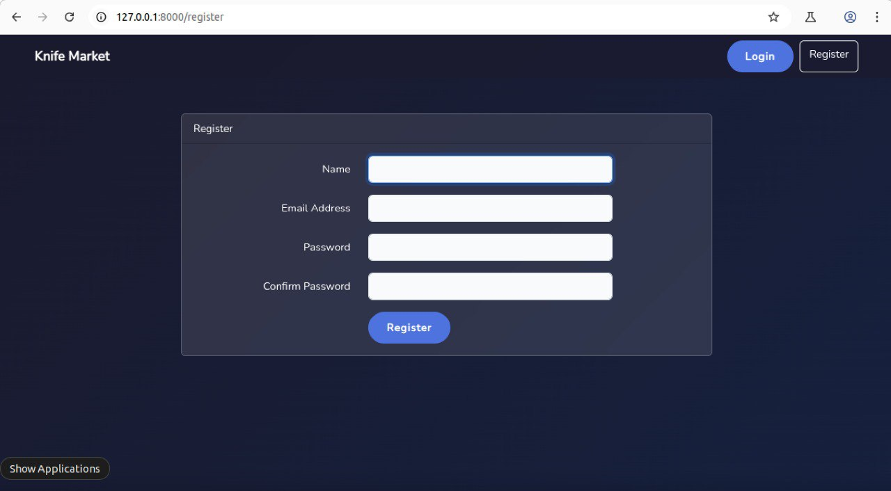
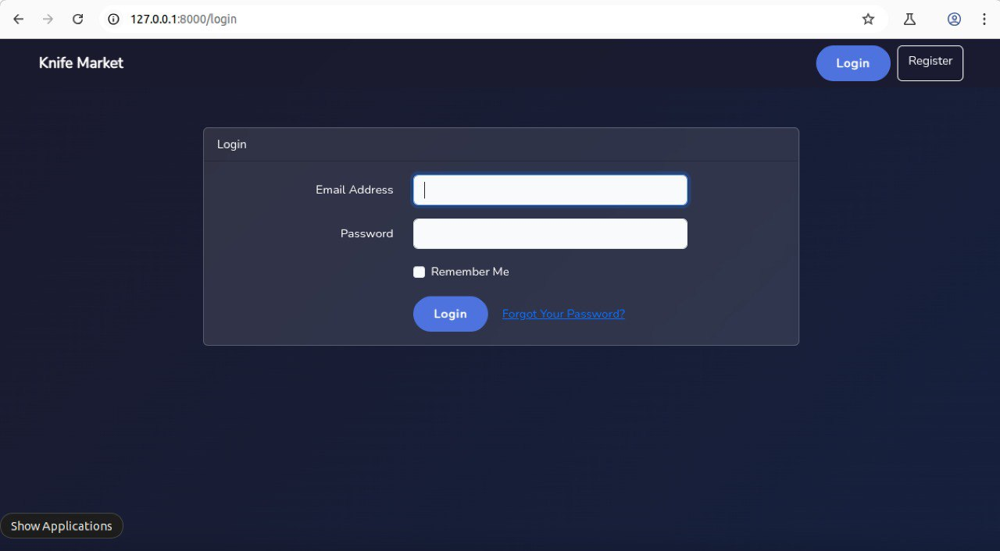
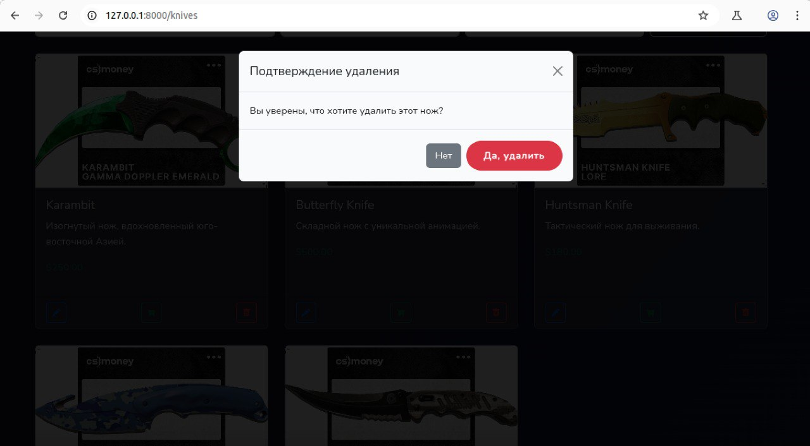

```markdown
<h1 align="center">Knife Market</h1>

#  Knife Market - Интернет-магазин ножей (CS:GO стиль)





Интернет-магазин ножей в стиле Counter-Strike с полным функционалом CRUD, корзиной покупок и системой авторизации.

##  Время разработки
**4 дня** (включая изучение новых тем и исправление ошибок)

##  Функционал
✅ **Система аутентификации**  
- Регистрация и вход 
- Выход из системы  

✅ **CRUD для ножей**  
- Добавление/редактирование/удаление ножей  
- Модальные окна для операций  
- Загрузка изображений  

✅ **Корзина покупок**  
- Добавление товаров (иконка "в корзину")  
- Автоматический пересчет суммы   

✅ **Поиск и фильтрация**  
- Поиск по названию/описанию  
- Фильтр по цене (min/max)  

✅ **Дополнительно**  
- Кликабельный логотип (возврат на главную)  
- Адаптивный дизайн (Bootstrap 5)  
- Сидеры для начального наполнения БД  

##  Технологии
- **Backend**: PHP 8, Laravel 10
- **Frontend**: Bootstrap 5
- **База данных**: MySQL
- **Сервер**: Linux (Nginx)

##  Установка
1. Клонировать репозиторий:
   ```bash
   git clone https://github.com/KuralayMukysheva/knifemarket.git
   cd knifemarket
   ```

2. Установить зависимости:
   ```bash
   composer install
   npm install
   ```

3. Настройка окружения:
   ```bash
   cp .env.example .env
   php artisan key:generate
   ```

4. Настройте БД в `.env`:
   ```ini
   DB_DATABASE=knifemarket
   DB_USERNAME=root
   DB_PASSWORD=
   ```

5. Запуск миграций:
   ```bash
   php artisan migrate --seed
   ```

6. Создать симлинк для хранилища:
   ```bash
   php artisan storage:link
   ```

7. Запуск сервера:
   ```bash
   php artisan serve
   ```

##  Преодоленные трудности
1. **Проблема с изображениями**  
   Решение: Настройка `php artisan storage:link`

2. **Реализация корзины**  
   Первый опыт реализации системы корзины с автоматическим подсчетом суммы

3. **Фильтрация и поиск**  
   Первый опыт реализации фильтрации и поиска

##  Что можно улучшить?
- [ ] Live-поиск (автоматический вывод результатов) 
- [ ] Восстановление пароля  
- [ ] Оформление заказа  
- [ ] Верификация email  
- [ ] Разделение ролей (Админ/Пользователь)  

##  Скриншоты
|  |  |
|-----------------------|----------------|
|     |  |

##  Разработчик
[Мукышева Куралай]  
[kura101@mail.ru](mailto:kura101@mail.ru) 
```
# knifemarket
Online market for selling knives for Counter Strike game on Steam
